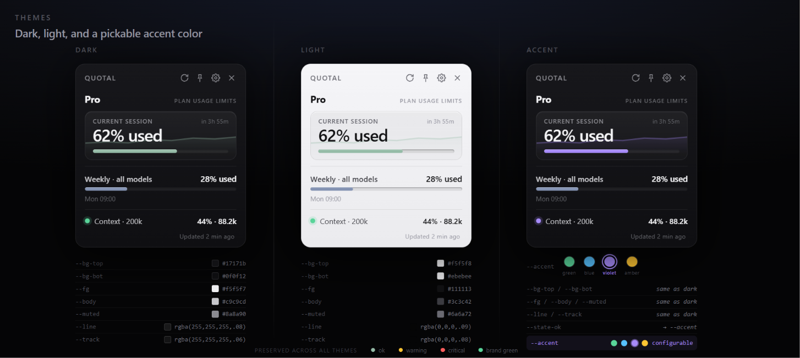
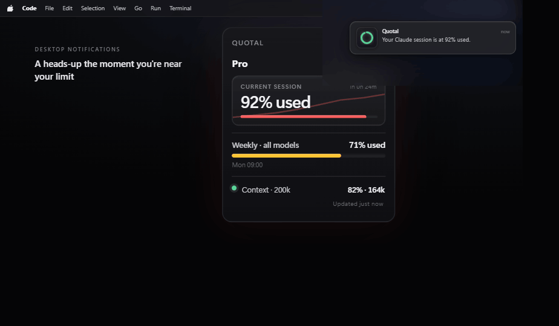
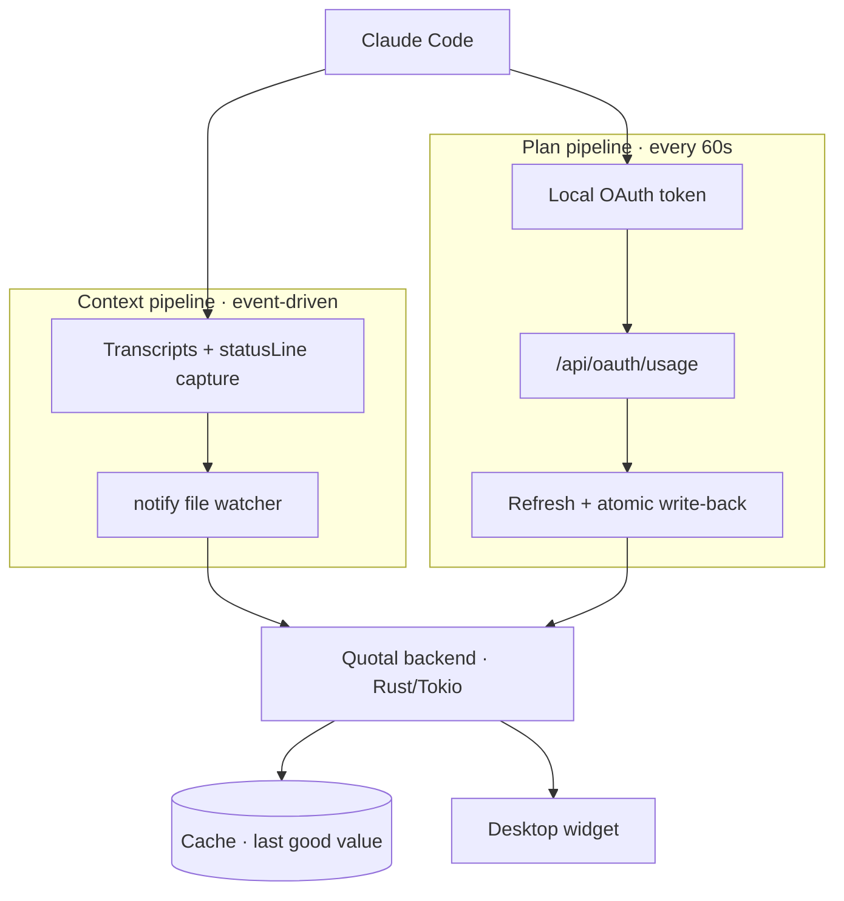

<div align="center">


# Quotal

**Never lose track of your Claude usage again.**

A tiny, always-on-top desktop widget that shows your live Claude usage, plan limits,
and the context window of your active Claude Code session — at a glance.

[](https://github.com/lopezinsua/quotal/releases)
[](https://github.com/lopezinsua/quotal/releases)
[](LICENSE)


</div>

---

## Demo

<div align="center">

<!-- Generated from docs/Demo.dc.html (animated mockup) — see docs/media/demo.gif -->


_Live session %, weekly quota and context window — always visible, no commands._

</div>

---

## Why Quotal?

You're deep in a Claude Code session and suddenly hit a limit — no warning, no idea how
close you were. Quotal keeps the **real** numbers in the corner of your screen so you
never get surprised again.

- 🔴 **Live session usage** — your 5-hour window, in real time
- 📅 **Weekly quota** — your 7-day plan limit
- 🧠 **Context window** — how full the active session is (200k / 1M, model-aware)
- 📌 **Always on top** — glanceable, never in the way
- 🌐 **Offline-friendly** — keeps working when the network drops
- 💻 **Cross-platform** — Windows, macOS, Linux

## Who is this for?

Perfect if you:

- ✔ Use **Claude Code** daily
- ✔ Keep forgetting how much quota you have left
- ✔ Want the **context window** visible without typing a command
- ✔ Like a lightweight, native widget instead of a browser tab

## Why not just use `/usage`?

`/usage` is great — but it's a **manual, one-shot** check inside the terminal. Quotal
turns that same data into something **ambient**.

| | `/usage` | **Quotal** |
| --- | :---: | :---: |
| Always visible | ❌ (manual) | ✅ |
| Updates automatically | ❌ | ✅ (every 60s) |
| Context window of current session | ❌ | ✅ |
| Tray icon with severity color | ❌ | ✅ |
| Works offline (last good value) | ❌ | ✅ |

> Quotal reads the **same** `/usage` data the CLI shows, reusing the OAuth token Claude
> Code already stores locally. Same numbers, just always on screen.

## Features

| Feature | Supported |
| --- | :---: |
| Live plan limits (session % + weekly %, real, not estimates) | ✅ |
| Reset times (same as `/usage`) | ✅ |
| Context window of active session (200k / 1M, model-aware) | ✅ |
| Pill mode (bar / ring / minimal, expands on hover) | ✅ |
| Light & dark themes + pickable accent color | ✅ |
| Tray icon, color by severity (normal / warning / critical) | ✅ |
| Desktop notifications when usage nears your limit (opt-in, configurable) | ✅ |
| Open / Close with Claude Code (optional, reversible hooks) | ✅ |
| In-app update notifications | ✅ |
| Remembers position & size, snaps to edges | ✅ |
| Offline fallback (`statusLine` data + last good value) | ✅ |
| 11 languages, auto-detected from your OS | ✅ |
| Windows / macOS / Linux | ✅ |

<sub>Languages: English, Español, 中文, हिन्दी, العربية, Português, Français, Deutsch, 日本語, Русский, 한국어.</sub>

## Screenshots

<div align="center">

**Desktop widget** — live session %, weekly quota and context window, always on top.


**Pill mode** — three compact styles (`bar` · `ring` · `minimal`), expands on hover.


**Themes** — light & dark, plus a pickable accent color (`green` · `blue` · `violet` · `amber`).



**Tray icon** — lives in your menu bar and changes color by severity (`normal` · `warning` · `critical`).


**Desktop notifications** — an opt-in heads-up the moment your session or weekly usage crosses your threshold.



</div>

## Install

Grab the installer for your OS from the [latest release](https://github.com/lopezinsua/quotal/releases):

| OS | Format |
| --- | --- |
| **Windows** | `.msi` or `.exe` (NSIS) |
| **macOS** | `.dmg` (universal: Apple Silicon + Intel) |
| **Linux** | `.AppImage` or `.deb` |

> [!NOTE]
> **Why the "unidentified developer" warning?** Quotal isn't code-signed yet — a signing
> certificate is a recurring paid subscription, and as a free MIT project it doesn't have
> one (a free OSS certificate via SignPath is being pursued). The warning is your OS being
> cautious about *unknown* publishers, **not** a sign anything is wrong. You can verify the
> download yourself with the published [`SHA256SUMS.txt`](#verify-your-download), and every
> in-app **auto-update is cryptographically signed** (see below). To run it:
> - **Windows** — click *More info → Run anyway*.
> - **macOS** — right-click the app → *Open* (then *Open* again).

### Verify your download

Every release ships a **`SHA256SUMS.txt`**. Confirm your installer hasn't been
tampered with before running it:

```bash
# Linux / macOS — checks every file listed in the manifest
sha256sum -c SHA256SUMS.txt
```

```powershell
# Windows — hash your file and compare it against the line in SHA256SUMS.txt
Get-FileHash .\Quotal_*_x64_en-US.msi -Algorithm SHA256
```

## Getting started

Once installed, you're up and running in a minute — no account, no config files to edit.

1. **Launch Quotal.** A small widget appears, always on top. The first numbers fill in
   as soon as it reads Claude Code's local data — usually within a few seconds.
2. **Make sure Claude Code is set up.** Quotal reuses the OAuth token Claude Code already
   stores locally, so just having signed in once with the CLI (`claude`) is enough. No
   token to paste anywhere.
3. **Position it.** Drag the widget where you like — it remembers its place and snaps to
   screen edges. Resize it from any corner.
4. **Pick a style (optional).** Open the settings panel with the **gear icon** on the
   widget to switch between the desktop widget and **pill mode** (`bar` · `ring` ·
   `minimal`), change language, or enable the tray icon.

That's it. From here on the widget refreshes on its own (session usage every 60s, context
window in real time) — you never type a command.

### Open / Close with Claude Code

In the settings panel you'll find two optional toggles:

- **Open with Claude Code** — Quotal launches automatically whenever you start a Claude
  Code session, so the widget is already there when you need it.
- **Close with Claude Code** — Quotal shuts itself down when your Claude Code session ends,
  so it's not left running in the background.

**How it works (and why it's safe):** enabling a toggle adds a small `SessionStart` /
`SessionEnd` **hook** to your Claude Code `settings.json`. The hook just runs Quotal (on
Windows via a hidden launcher, so no console window flashes) and only if it isn't already
running. Each hook carries a unique marker so Quotal can find exactly its own entry:

- It **never touches your other hooks** — it only adds or removes its own group.
- Turning a toggle **off** restores `settings.json` to exactly what it was before.
- Writes are **atomic** (temp file + rename), so a crash mid-write can't corrupt your
  settings.

So the feature is fully **opt-in and reversible** — leave both off and Quotal changes
nothing in Claude Code.

## Security

> [!IMPORTANT]
> 🔒 **Your data never leaves your machine.**
>
> - **No telemetry. No analytics. No accounts. No cloud.** Quotal makes exactly one kind
>   of network call: to Anthropic's own `/usage` endpoint — the *same* request the Claude
>   Code CLI already makes. Nothing is ever sent anywhere else.
> - Quotal **never creates or stores credentials of its own** — it reuses the OAuth token
>   Claude Code already keeps locally, and never copies it elsewhere.
> - **Signed auto-updates.** In-app updates are verified end-to-end with a
>   [minisign](https://jedisct1.github.io/minisign/) public key embedded in the app, so an
>   update can only install if it was signed with the matching private key — a tampered or
>   spoofed update is rejected automatically.
> - Every write to `settings.json` and credential files is **atomic** (tmp + rename)
>   and **idempotent**. Any installed hook is fully **reversible** — removing it
>   restores your previous config exactly.
> - **Open source (MIT).** The entire codebase is here to audit — nothing is hidden.

## How it works

Quotal runs two non-blocking pipelines (everything on Tokio tasks — the UI thread is
never blocked):



1. **Context** (offline, event-driven): a `notify` file watcher reacts to Claude Code's
   transcripts and `statusLine` capture, consolidating the live context window.
2. **Plan limits** (online): polls `/api/oauth/usage` every 60s using the local OAuth
   token, refreshing it when needed and writing it back atomically — exactly the way
   Claude Code does, so the two stay in sync.

## Build from source

Requires [Rust](https://rustup.rs) and [Node.js](https://nodejs.org) 20+.

```bash
npm install
npm run dev      # run in development
npm run build    # produce a native installer for the current OS
```

On Linux you'll also need the WebKitGTK / app-indicator dev packages:

```bash
sudo apt-get install -y libwebkit2gtk-4.1-dev librsvg2-dev patchelf libayatana-appindicator3-dev
```

## Release

Pushing a `vX.Y.Z` tag triggers the GitHub Actions workflow, which builds native
installers on Windows, macOS and Linux runners and attaches them to a draft release.

```bash
git tag v0.3.2
git push origin v0.3.2
```

## Roadmap

- [x] Windows, macOS, Linux
- [x] In-app update notifications
- [x] Open / Close with Claude Code
- [x] 11 languages
- [x] Desktop notifications on threshold (e.g. 90% used)
- [x] Light & dark themes + accent color
- [ ] Code-signed builds (no more "unidentified developer" warning)

## FAQ

**Does Quotal send my token anywhere?**
No. It reuses Claude Code's local OAuth token and only talks to Anthropic's own
`/usage` endpoint — the same one the CLI uses.

**Does it modify Claude or Claude Code?**
No. The only optional change is a reversible hook (open/close with your session) that
you opt into and can remove at any time.

**Does it work offline?**
Yes. It keeps the last good value and falls back to Claude Code's `statusLine` data
when there's no network.

**Does it support Max plans?**
Yes — it reads whatever plan your account has, the same numbers as `/usage`.

## Changelog

See [CHANGELOG.md](CHANGELOG.md) for the full list of changes per release.

## License

[MIT](LICENSE) © lopezinsua
