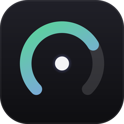
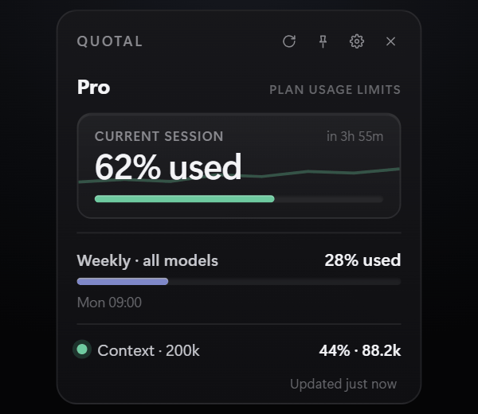
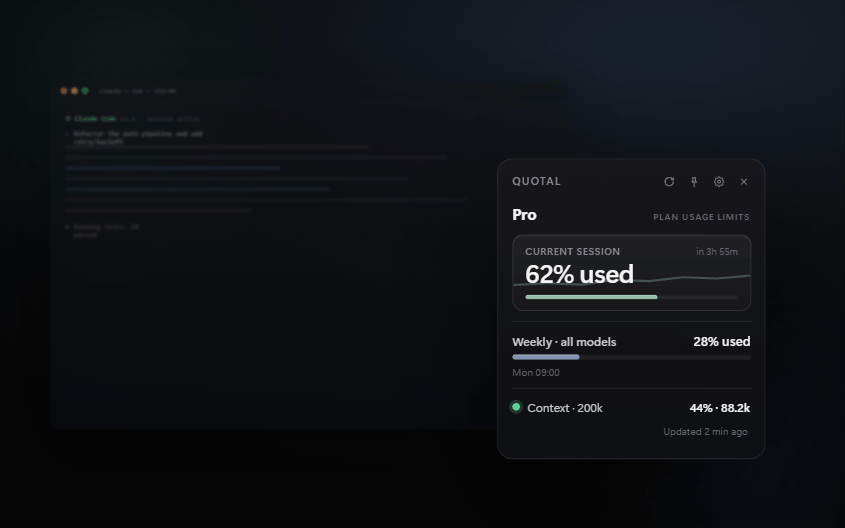
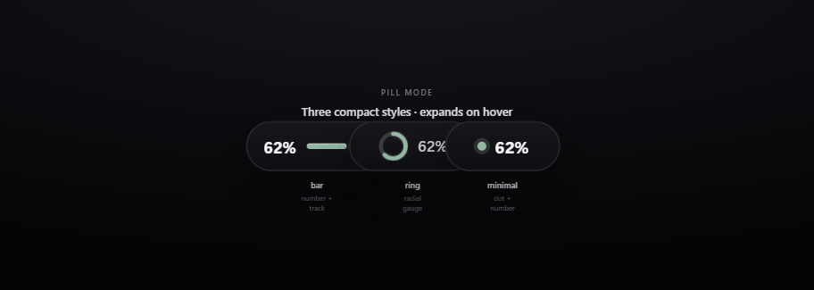
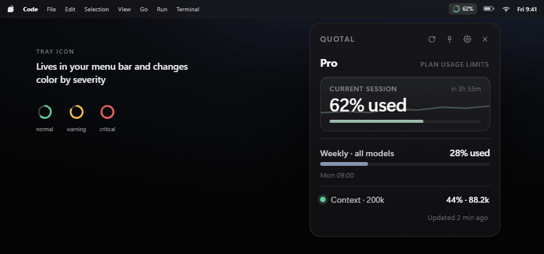

<div align="center">



# Quotal

**Never lose track of your Claude usage again.**

A tiny, always-on-top desktop widget that shows your live Claude usage, plan limits,
and the context window of your active Claude Code session — at a glance.

[](https://github.com/lopezinsua/quotal/releases)
[](https://github.com/lopezinsua/quotal/releases)
[](LICENSE)


</div>

---

## Demo

<div align="center">

<!-- Generated from docs/Demo.dc.html (animated mockup) — see docs/media/demo.gif -->



_Live session %, weekly quota and context window — always visible, no commands._

</div>

---

## Why Quotal?

You're deep in a Claude Code session and suddenly hit a limit — no warning, no idea how
close you were. Quotal keeps the **real** numbers in the corner of your screen so you
never get surprised again.

- 🔴 **Live session usage** — your 5-hour window, in real time
- 📅 **Weekly quota** — your 7-day plan limit
- 🧠 **Context window** — how full the active session is (200k / 1M, model-aware)
- 📌 **Always on top** — glanceable, never in the way
- 🌐 **Offline-friendly** — keeps working when the network drops
- 💻 **Cross-platform** — Windows, macOS, Linux

## Who is this for?

Perfect if you:

- ✔ Use **Claude Code** daily
- ✔ Keep forgetting how much quota you have left
- ✔ Want the **context window** visible without typing a command
- ✔ Like a lightweight, native widget instead of a browser tab

## Why not just use `/usage`?

`/usage` is great — but it's a **manual, one-shot** check inside the terminal. Quotal
turns that same data into something **ambient**.

| | `/usage` | **Quotal** |
| --- | :---: | :---: |
| Always visible | ❌ (manual) | ✅ |
| Updates automatically | ❌ | ✅ (every 60s) |
| Context window of current session | ❌ | ✅ |
| Tray icon with severity color | ❌ | ✅ |
| Works offline (last good value) | ❌ | ✅ |

> Quotal reads the **same** `/usage` data the CLI shows, reusing the OAuth token Claude
> Code already stores locally. Same numbers, just always on screen.

## Features

| Feature | Supported |
| --- | :---: |
| Live plan limits (session % + weekly %, real, not estimates) | ✅ |
| Reset times (same as `/usage`) | ✅ |
| Context window of active session (200k / 1M, model-aware) | ✅ |
| Pill mode (bar / ring / minimal, expands on hover) | ✅ |
| Tray icon, color by severity (normal / warning / critical) | ✅ |
| Open / Close with Claude Code (optional, reversible hooks) | ✅ |
| In-app update notifications | ✅ |
| Remembers position & size, snaps to edges | ✅ |
| Offline fallback (`statusLine` data + last good value) | ✅ |
| 11 languages, auto-detected from your OS | ✅ |
| Windows / macOS / Linux | ✅ |

<sub>Languages: English, Español, 中文, हिन्दी, العربية, Português, Français, Deutsch, 日本語, Русский, 한국어.</sub>

## Screenshots

<!-- Add real captures to docs/media/ and they'll render here. -->

| Desktop | Pill mode | Tray |
| :---: | :---: | :---: |
|  |  |  |

## Install

Grab the installer for your OS from the [latest release](https://github.com/lopezinsua/quotal/releases):

| OS | Format |
| --- | --- |
| **Windows** | `.msi` or `.exe` (NSIS) |
| **macOS** | `.dmg` (universal: Apple Silicon + Intel) |
| **Linux** | `.AppImage` or `.deb` |

> [!NOTE]
> Until the app is code-signed, your OS may warn that it's from an unidentified
> developer. On **Windows** click *More info → Run anyway*; on **macOS** right-click
> the app → *Open*.

## Security

> [!IMPORTANT]
> 🔒 **Your token never leaves your machine.**
>
> - Quotal **never creates or stores credentials of its own** — it reuses the OAuth
>   token Claude Code already keeps locally.
> - **No telemetry. No cloud. No external servers** (other than Anthropic's own
>   `/usage` endpoint, the same one the CLI calls).
> - Every write to `settings.json` and credential files is **atomic** (tmp + rename)
>   and **idempotent**. Any installed hook is fully **reversible** — removing it
>   restores your previous config exactly.

## How it works

Quotal runs two non-blocking pipelines (everything on Tokio tasks — the UI thread is
never blocked):

```mermaid
flowchart TD
    CC[Claude Code]

    subgraph Offline["Context pipeline · event-driven"]
        T[Transcripts + statusLine capture] --> W[notify file watcher]
    end

    subgraph Online["Plan pipeline · every 60s"]
        O[Local OAuth token] --> U[/api/oauth/usage]
        U --> R[Refresh + atomic write-back]
    end

    CC --> T
    CC --> O
    W --> B[Quotal backend · Rust/Tokio]
    R --> B
    B --> C[(Cache · last good value)]
    B --> G[Desktop widget]
```

1. **Context** (offline, event-driven): a `notify` file watcher reacts to Claude Code's
   transcripts and `statusLine` capture, consolidating the live context window.
2. **Plan limits** (online): polls `/api/oauth/usage` every 60s using the local OAuth
   token, refreshing it when needed and writing it back atomically — exactly the way
   Claude Code does, so the two stay in sync.

## Build from source

Requires [Rust](https://rustup.rs) and [Node.js](https://nodejs.org) 20+.

```bash
npm install
npm run dev      # run in development
npm run build    # produce a native installer for the current OS
```

On Linux you'll also need the WebKitGTK / app-indicator dev packages:

```bash
sudo apt-get install -y libwebkit2gtk-4.1-dev librsvg2-dev patchelf libayatana-appindicator3-dev
```

## Release

Pushing a `vX.Y.Z` tag triggers the GitHub Actions workflow, which builds native
installers on Windows, macOS and Linux runners and attaches them to a draft release.

```bash
git tag v0.3.2
git push origin v0.3.2
```

## Roadmap

- [x] Windows, macOS, Linux
- [x] In-app update notifications
- [x] Open / Close with Claude Code
- [x] 11 languages
- [ ] Code-signed builds (no more "unidentified developer" warning)
- [ ] Custom themes
- [ ] Desktop notifications on threshold (e.g. 90% used)

## FAQ

**Does Quotal send my token anywhere?**
No. It reuses Claude Code's local OAuth token and only talks to Anthropic's own
`/usage` endpoint — the same one the CLI uses.

**Does it modify Claude or Claude Code?**
No. The only optional change is a reversible hook (open/close with your session) that
you opt into and can remove at any time.

**Does it work offline?**
Yes. It keeps the last good value and falls back to Claude Code's `statusLine` data
when there's no network.

**Does it support Max plans?**
Yes — it reads whatever plan your account has, the same numbers as `/usage`.

## Changelog

See [CHANGELOG.md](CHANGELOG.md) for the full list of changes per release.

## License

[MIT](LICENSE) © lopezinsua
